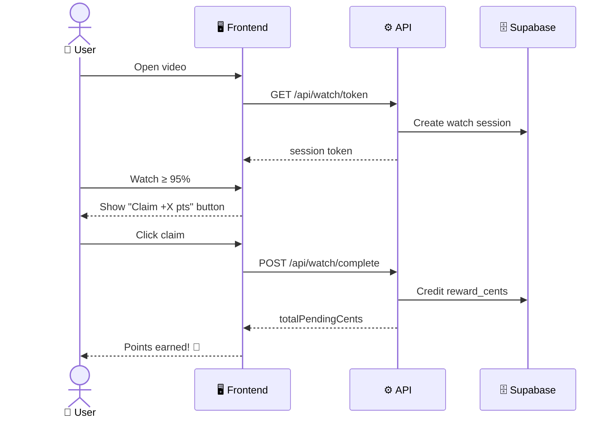
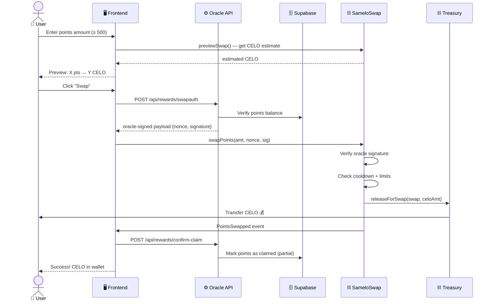

# Samelo — Watch & Earn

Turn your attention into income. Watch short videos and earn CELO directly to your MiniPay wallet. Built on Celo with fully on-chain rewards infrastructure.

[](https://celoscan.io)
[](https://nextjs.org)
[](https://soliditylang.org)
[](https://book.getfoundry.sh)

---

## Overview

Samelo is a watch-to-earn platform where users earn points by watching sponsored video content, then swap those points for **CELO** directly on-chain. No KYC, no seed phrases — just open MiniPay and start earning.

### Live Contracts (Celo Mainnet)

| Contract | Address | Type |
|---|---|---|
| **Treasury** | [`0x6F5De33BB872DCf…`](https://celoscan.io/address/0x6F5De33BB872DCf5ca0ca7850E88610C8f794A92) | UUPS Proxy |
| **Swap** | [`0x7774b6b94D7C6885…`](https://celoscan.io/address/0x7774b6b94D7C688587bf6a91FF8Be60dF80A446B) | UUPS Proxy |
| **Points** | [`0xbCd833EBcC842587…`](https://celoscan.io/address/0xbCd833EBcC842587542c027Cf7B7EAC5D109a9F8) | UUPS Proxy |

---

## System Architecture

```mermaid
graph TB
    subgraph User["👤 User (MiniPay Wallet)"]
        WATCH["Watch Videos"]
        EARN["Earn Points"]
        SWAP["Swap → CELO"]
        CLAIM["Claim Rewards"]
    end

    subgraph Frontend["🖥️ Next.js Frontend"]
        FEED["FeedContent<br/>Video Player"]
        POINTS["Points Dashboard"]
        SWAPUI["Swap Page"]
        LANDING["Landing Page"]
    end

    subgraph Backend["⚙️ API Layer"]
        AUTH["Watch Auth<br/>/api/watch/token"]
        COMPLETE["Watch Complete<br/>/api/watch/complete"]
        SWAPAUTH["Swap Auth<br/>/api/rewards/swapauth"]
        CLAIMABLE["Claimable<br/>/api/rewards/claimable"]
        CONFIRM["Confirm Claim<br/>/api/rewards/confirm-claim"]
    end

    subgraph DB["🗄️ Supabase"]
        WATCHES["watches table<br/>(off-chain points)"]
        CLAIMS["claims table<br/>(tx records)"]
        VIDEOS["videos table<br/>(content catalog)"]
    end

    subgraph Chain["⛓️ Celo Mainnet"]
        TREASURY["SameloTreasury<br/>UUPS Proxy"]
        SWAPC["SameloSwap<br/>UUPS Proxy"]
        POINTSC["SameloPoints<br/>UUPS Proxy"]
    end

    WATCH --> FEED
    FEED --> AUTH
    AUTH -->|"verify session"| DB
    FEED -->|"100% watched"| COMPLETE
    COMPLETE -->|"credit points"| WATCHES
    EARN --> POINTS
    POINTS -->|"read balance"| WATCHES
    SWAP --> SWAPUI
    SWAPUI --> SWAPAUTH
    SWAPAUTH -->|"check points"| WATCHES
    SWAPAUTH -->|"oracle signature"| SWAPUI
    SWAPUI -->|"swapPoints()"| SWAPC
    SWAPC -->|"releaseForSwap()"| TREASURY
    TREASURY -->|"transfer CELO"| User
    CLAIM --> CLAIMABLE
    CLAIMABLE -->|"check points"| WATCHES
    CLAIMABLE -->|"oracle signature"| User
    CLAIM -->|"executeRewardAction()"| TREASURY
    TREASURY -->|"transfer CELO"| User
    CONFIRM -->|"mark claimed"| WATCHES

    style User fill:#1a1a1a,stroke:#c8f135
    style Chain fill:#1a1a1a,stroke:#35d07f
    style DB fill:#1a1a1a,stroke:#5b9bd5
```



---

## Core Flows

### 1. Watch & Earn Points



**Anti-abuse:** Videos require a signed watch session token. Server-side deduplication prevents double-claiming. Skip-detection prevents fast-forwarding.

### 2. Swap Points → CELO



**Key on-chain checks:** `require(pointAmount >= minSwapPoints)` (min 500), `require(!usedNonces[nonce])` (anti-replay), `require(timestamp >= lastSwapTime + cooldown)` (1 day cooldown), ECDSA oracle signature verification.

### 3. Treasury Revenue Flow

```mermaid
graph LR
    AD["Advertiser CELO"] -->|"depositRevenue()"| T["Treasury"]
    T -->|"90%"| RP["Reward Pool"]
    T -->|"10%"| RV["Reserve"]
    RP -->|"releaseForSwap()"| SWAP["Swap Contract"]
    RP -->|"releaseReward()"| USR["User Wallet"]
    RV -->|"withdrawReserve()"| ADM["Admin (operational)"]

    style T fill:#1a1a1a,stroke:#35d07f,stroke-width:2px
    style RP fill:#112211,stroke:#35d07f
    style RV fill:#221111,stroke:#fbcc5c
```



---

## Project Structure

```
samelo/
├── app/
│   ├── (landing)/          # Landing page + components
│   ├── (app)/              # Authenticated app routes
│   │   ├── swap/           # Points → CELO swap page
│   │   ├── earnings/       # Earnings history
│   │   ├── watch/          # Main watch feed
│   │   └── layout.tsx      # App shell + ChainGuard
│   ├── api/
│   │   ├── rewards/        # Claims, swap auth, pending, confirm
│   │   ├── watch/          # Video session tokens + completion
│   │   └── analytics/      # Usage tracking
│   ├── components/         # Shared UI components
│   │   ├── landing/        # Landing page sections
│   │   ├── VideoPlayer.tsx # Watch progress + claim UI
│   │   ├── ChainGuard.tsx  # Network enforcement
│   │   └── ...
│   └── layout.tsx          # Root layout + providers
├── hooks/                  # Custom React hooks
│   ├── useSwapPoints.ts    # Swap flow (oracle → contract)
│   ├── useClaim.ts         # Claim reward flow
│   ├── useAutoConnect.ts   # Auto wallet connection
│   └── ...
├── lib/                    # Utilities & config
│   ├── wagmi.ts            # Wagmi config (auto mainnet/testnet)
│   ├── chains.ts           # Celo chain definitions
│   ├── swap.abi.ts         # SameloSwap ABI
│   ├── treasury.abi.ts     # SameloTreasury ABI
│   ├── points.abi.ts       # SameloPoints ABI
│   └── supabase.ts         # Supabase client
├── samelo-contracts/       # Foundry project
│   ├── src/
│   │   ├── SameloTreasury.sol   # Fund manager (UUPS)
│   │   ├── SameloSwap.sol       # Points→CELO swap (UUPS)
│   │   ├── SameloPoints.sol     # On-chain points (UUPS)
│   │   ├── SameloToken.sol      # $MELO ERC-20 (immutable)
│   │   └── interfaces/
│   ├── script/
│   │   ├── DeployFull.s.sol         # Deploy Treasury + Swap
│   │   ├── DeployMelo.s.sol         # Deploy Token + Points
│   │   └── DeployPoints.s.sol       # Deploy Points standalone
│   └── foundry.toml
├── supabase/
│   └── functions/          # Edge functions
└── .deployment.mainnet.json # Deployment record (gitignored)
```

---

## Tech Stack

| Layer | Technology |
|---|---|
| **Frontend** | Next.js 16, React 19, TypeScript, Tailwind CSS v4 |
| **Animations** | Framer Motion |
| **Web3** | wagmi v3, viem v2 |
| **State** | TanStack React Query v5 |
| **Backend** | Next.js API Routes, Supabase (Postgres) |
| **Smart Contracts** | Solidity 0.8.24, Foundry |
| **Upgradeability** | OpenZeppelin UUPS (ERC-1967 Proxy) |
| **Chain** | Celo Mainnet (42220) |
| **Wallet** | Opera MiniPay (native), Zerion, MetaMask |

---

## Smart Contracts

### SameloTreasury (`0x6F5D…`)
Central fund manager. Receives ad revenue, splits into reward pool (90%) and reserve (10%). Only contracts with `SWAP_ROLE` can release for swaps.

### SameloSwap (`0x7774…`)
One-click points → CELO swap. Oracle pre-signs payloads; user submits single `swapPoints()` tx. Validates minimum (500 pts), maximum (50K pts), 1-day cooldown, nonce anti-replay, and ECDSA signature.

### SameloPoints (`0xbCd8…`)
On-chain points ledger. Users earn 10 pts per click (1hr cooldown). Redeemable for $MELO when token launches. Redeem disabled until `meloToken` is configured.

### Upgradeability
All three core contracts use **UUPS (ERC-1967)** proxies. Only the admin can upgrade. Storage layout is preserved across upgrades. See `.deployment.mainnet.json` for upgrade guide.

---

## Getting Started

### Prerequisites
- Node.js ≥ 18
- npm or yarn
- Foundry (for contracts)

### Environment Setup

```bash
cp .env.local.example .env.local
# Fill in .env.local with your values
```

Required env vars:

```env
# Chain
NEXT_PUBLIC_CHAIN_ENV=mainnet
NEXT_PUBLIC_CELO_RPC=https://forno.celo.org

# Contracts
NEXT_PUBLIC_TREASURY_ADDRESS=0x...
NEXT_PUBLIC_SWAP_ADDRESS=0x...
NEXT_PUBLIC_POINTS_ADDRESS=0x...

# Oracle
REWARD_ORACLE_PRIVATE_KEY=0x...
MIN_SWAP_POINTS=500
POINTS_TO_CELO_RATE_WEI=10000000000000

# Supabase
NEXT_PUBLIC_SUPABASE_URL=https://...
NEXT_PUBLIC_SUPABASE_ANON_KEY=eyJ...
SUPABASE_SERVICE_ROLE_KEY=eyJ...
```

### Development

```bash
npm install
npm run dev        # Start Next.js dev server
```

### Contracts

```bash
cd samelo-contracts
forge build        # Compile
forge script script/DeployFull.s.sol:DeployFull --rpc-url ... -vvv  # Simulate
```

---

## Revenue Model

- **Advertisers** pay CELO to place sponsored video content
- Revenue is deposited on-chain via `SameloTreasury.depositRevenue()`
- **90%** auto-routed to the reward pool for user payouts
- **10%** reserved for protocol operations
- All splits are transparent and verifiable on-chain
- Model inspired by Brave Rewards but fully decentralized

---

## Anti-Abuse

| Mechanism | Layer |
|---|---|
| Watch session tokens (HMAC-signed) | API |
| Server-side deduplication | Supabase |
| Skip/fast-forward detection | Edge Function |
| Minimum swap (500 pts) | On-chain |
| Swap cooldown (1 day) | On-chain |
| Nonce anti-replay | On-chain |
| Oracle ECDSA signature | On-chain + API |
| Rate limiting (earn) | API |

---

## Roadmap

- [x] Celo Mainnet deployment (Treasury + Swap + Points)
- [x] UUPS upgradeable contracts
- [x] Points → CELO swap flow
- [x] Watch progress tracking (95% completion requirement)
- [x] Chain Guard for network enforcement
- [ ] $MELO token launch + wire to Points
- [ ] Referral system
- [ ] Multi-language (EN / ES / SW)
- [ ] Mission system (watch all videos → bonus)

---

## License

MIT
